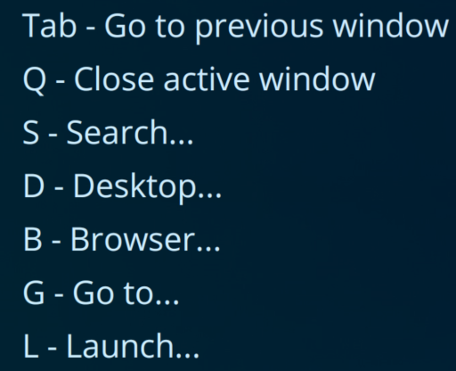

# PyWinModal

- [PyWinModal](#pywinmodal)
  - [Installation](#installation)
  - [Quick start](#quick-start)
    - [TL;DR](#tldr)
  - [Extending functionality](#extending-functionality)
  - [Provided extensions](#provided-extensions)
  - [Limitations and known issues](#limitations-and-known-issues)

PyWinModal is an application inspired by [Spacemacs](https://www.spacemacs.org/) and [vim-which-key](https://github.com/liuchengxu/vim-which-key)/[which-key.nvim](https://github.com/folke/which-key.nvim) that allows you to bind a leader key to bring up a modal for issuing commands to Windows. For example, if you bind your leader key to Caps Lock, you could press Caps>S>G to **S**earch **G**oogle, or Caps>G>B to **G**o to the **B**rowser. The modal is customizable with a simple API and can be easily extended to execute user-defined commands.



## Installation

Use [Poetry](https://github.com/python-poetry/poetry) to install dependencies with `poetry install`, then run the application with `poetry run app`.

## Quick start

The first thing you should do is decide on a leader key with which to summon the modal. PyWinModal uses the [keyboard](https://pypi.org/project/keyboard/) library for monitoring key presses, so any key press valid for the keyboard library should work. The format is pretty simple: `"esc"`, `"tab"`, "`ctrl+f4`", etc. Function keys from F13 to F24 are supported as well.

After doing that, you can configure and run the modal in the following manner:

```python
# import the necessary packages
from PyWinModal.lib.extensions import *
from PyWinModal.lib.types import Action, Switch
from PyWinModal.lib.ui import Modal, OptionsList

# for high-dpi displays
from ctypes import windll
windll.shcore.SetProcessDpiAwareness(1)

# Create a modal object
modal = Modal(
    [ # The modal's first argument is a list of OptionsList objects
        OptionsList( # The OptionsList object is used to group options together
            "Example1", # The name of the list
            # A list of Action or Switch objects
            [
                # Actions let you bind keys to commands
                Action(
                    "tab", # The key that activates the command
                    "Go to previous window",  # The text that shows up in the modal
                    activate_last_window() # The command to execute
                ),
                # Switches let you bind a key to switch to another options list
                Switch(
                    "s", # The key to activate the switch
                    "Example2" # The list to show
                ), 
            ],
        ),
        # When the Switch is activated in the previous OptionsList, this OptionsList is shown
        OptionsList(
            "Example2",
            [
                # repeatable=True lets you issue a command multiple times without closing the modal
                Action("t", "New tab", send_keys_to_active_window("ctrl+t"), repeatable=True), 
                Action("s", "Search Google", search_web("Google", "https://www.google.com/search?q=%s")),
                Switch("b", "Example1"), # Go back to Example1
            ],
        ),
    ],
    "Example1", # The name of the default OptionsList to show
    "F24", # The key that summons the modal
)
# Run the modal
modal.run()
# A tray icon will appear in the taskbar and the modal can now be summoned by pressing the leader key
```

### TL;DR

Add a list of `Action` and/or `Switch` objects to `OptionsList` objects then add a list of `OptionsList` objects to a `Modal` object and call `run()` on it.

- `Action` binds a key to a function
- `Switch` binds a key to another options list
- `repeatable=True` lets you issue a command multiple times

## Extending functionality

To provide your own actions, simply add a function in `PyWinModal.lib.extensions` that returns another function:

```python
def do_something():
    return lambda: print("Hello world!")

def do_something_more_complicated(arg1, arg2):
    def action():
        print(arg1, arg2)
    return action
```

You can now add it as an action in the modal as shown above.

## Provided extensions

`close_active_window()` - Closes the window that was active before the modal was summoned.

`activate_last_window()` - Activates the previous window (like alt+tab).

`open_application(application: str)` - Opens the application at the full path provided.

`summon_or_launch(application: str)` - Takes a full path. Attempts to summon the application if it is already running, otherwise launches it.

`go_to_window_by_title(title: str)` - Goes to the window with the provided title. Partial matches are supported.

`go_to_window_by_exe(exe: str)` - Goes to the window with the provided executable name. Partial matches are not supported. If multiple windows match, the first one that is not currently active is activated.

`send_keys_to_active_window(keys: str)` - Sends the provided key(s) to the active window. This can be used to send any hotkeys to any application to perform actions like saving, navigation, etc. Uses the [keyboard](https://pypi.org/project/keyboard/) library to parse the `keys` argument.

`send_keys_to_window_by_title(title: str, keys: str)` - The same as the previous, but the window does not have to be active. Raises the window to the foreground to send the key(s) if it is not active.

`search_web(title: str, url: str)` - Bring up a text box to search the URL given to`url` where `%s` is replaced with the query entered in the text box. `title` is the name of the search engine.

`toggle_dark_mode()` - Toggles the Windows dark mode setting.

`lock_workstation()` - Locks the workstation (same as Win+L).

`empty_clipboard()` - Empties the clipboard.

`minimize_active_window()` - Minimizes the active window.

## Limitations and known issues

The modal's title bar can't be hidden as it results in inconsistent focus grabbing. This is a limitation of the GUI backend being used.
